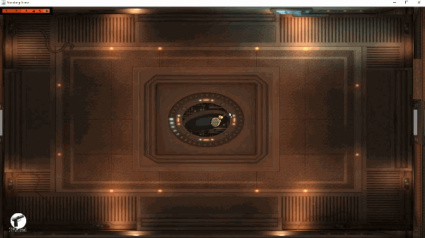
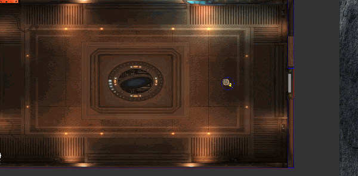

# Java Shootting Game #

此遊戲專題為使用 Java 原生 lib 製作之俯視角度的射擊遊戲，目的為學習用  
WASD 可移動，滑鼠點擊可射擊

---------------------------------------

# 技術介紹 #

## 使用到的技術 ##

* Java
* Java 原生 libs 如:
  * java.awt.Graphics
  * javax.swing.JFrame
  * java.awt.event.KeyEvent 等等

## 程式設計 ##

透過 GIF 圖片中的演示可以看到其中幾個遊戲中的功能或細節:  
  
1. 玩家走過門後門自動關起來(避免玩家回上一個房間)  
2. 畫面上方出現字幕  
3. 禁止玩家移動，畫面向右帶直到契合整個房間後停止  
4. 字幕消失後箱子釋放怪物並靠近玩家  
  
5. 當玩家畫面還沒看到物件前，先不畫出來節省效能直到進入視野才畫
  (為便於觀察，圖片中展示的是debug mode)

機制實作:

* [字幕條](https://github.com/wolke1007/cmoney_project_shootinggame/blob/Dev/src/textbar/TextBar.java)，可餵字串進去播放且可控制播放的時機
* [視野控制](https://github.com/wolke1007/cmoney_project_shootinggame/blob/Dev/src/gameobj/View.java)，若超過視野(畫面)大小的物件不畫出來節省效能
* [事件控制](https://github.com/wolke1007/cmoney_project_shootinggame/blob/Dev/src/event/Event.java)，控制全部關卡的過程與順序也能做到擴充，例如:
  * 玩家走過門後 -> 關門 -> 播放字幕 -> 釋放怪物  等等
* [角色特效控制](https://github.com/wolke1007/cmoney_project_shootinggame/blob/Dev/src/effects/Effect.java)，可方便的擴充新特效:
  * 殘血時需要有特殊畫面效果及播放音效

---------------------------------------

***此專案中使用之源自網路所有圖片皆為該原創作者擁有  
本專案僅供教學、測試使用並無任何營利，仍如有侵權還請告知撤除***
